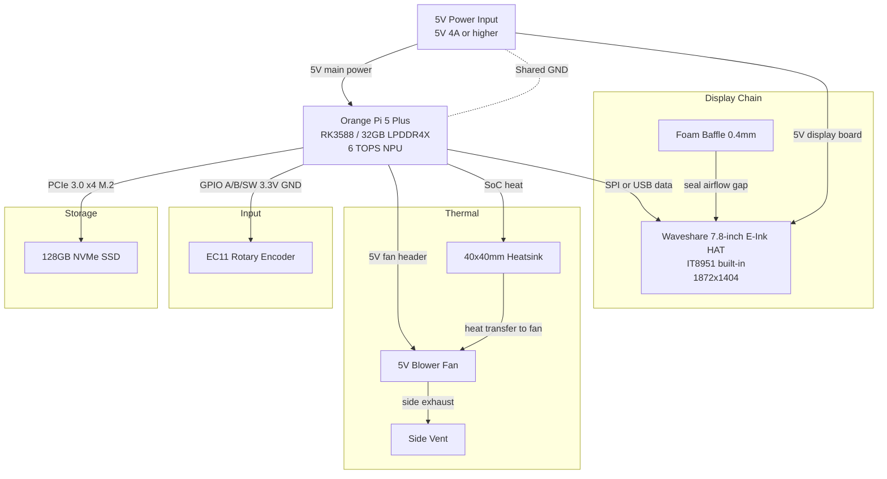

# NEXUS-INK

As a JJK fan, keeping up with the internet is a full-time job, with the finishing of JJK Season 3 my mornings on the  r/JuJutsuKaisen front page is forty threads deep in anime fans asking "wait does Gojo win the fight with Sukuna" — spoiler he doesn't, he gets cut in half by mahoraga, and the manga community has known this for two years and it's exhausting; some insisting Megumi will be freed from Sukuna by the power of friendship, and one unhinged posts arguing that Kenjaku's  been controlling Gege Akutami's hand since chapter 1 to deliberately cause reader suffering as a cursed technique. Filtering through all of that with two thumbs and a phone screen is, frankly, a war of attention-span I was losing.

Which inspired me to make NEXUS-INK, a standalone e-ink news terminal built around the Orange Pi 5 Plus: it pulls posts from whatever subreddits the user specifies (see Python files), summarises them locally using a small on-device LLM, and displays the result on a 7.5-inch e-ink screen — no notifications, no algorithm, no glare, no doom-scrolling. Just the good stuff, distilled, on a screen that looks and feels like paper.

---
## Wiring Diagram (using mermaid)

---
## Full Assembly Render

  

    
    
    
  

  

    
    
  

## Rough Hardware Render

  

    
    
    
  

  

    
    
  

## Bill of Materials (BOM)
| Comment | Location | Interface | Link | Quantity | Total Price |
|---|---|---|---|---|---|
| **Orange Pi 5 Plus 32GB** | **Base mount, centre** | **—** | **https://www.alibaba.com/product-detail/Orange-Pi-5-Plus-32GB-RAM_1601051236285.html** | **1** | **€230.00** |
| **Waveshare 7.8inch E-Ink HAT** | **Front face, top panel** | **SPI / USB** | **https://www.alibaba.com/product-detail/WaveShare-1872-X-1404-7-8Inch_1600763875848.html** | **1** | **€115.00** |
| EC11 Rotary Encoder | Right side panel | GPIO BCM 17/18/27 | https://www.aliexpress.com | 1 | ~€2.00 |
| 128GB NVMe SSD M.2 2280 | OPi M.2 slot | PCIe 3.0 x4 | https://www.amazon.it | 1 | ~€20.00 |
| 5V Blower Fan 50×15mm | Rear internal | 5V fan header | https://www.aliexpress.com | 1 | ~€5.00 |
| 40×40mm Aluminium Heatsink | OPi SoC top | Thermal adhesive | https://www.aliexpress.com | 1 | ~€4.00 |
| 5V 4A Power Supply USB-C | Rear port | 5V rail | https://www.amazon.it | 1 | ~€10.00 |
| Foam Baffle Strip 0.4mm | Display perimeter | Adhesive | https://www.aliexpress.com | 1 | ~€2.00 |
| Dupont Jumper Wires F-F 10cm | Internal routing | GPIO headers | https://www.aliexpress.com | 1 set | ~€2.00 |
| 3D Printed Shell | Outer enclosure | — | — | 1 | Free |

> **Bold items are funded by Hackclub**
>
> **Total requested from Hackclub: €345 (€230.00 + €115.00), est ≈398 usd **
> 
> Self-funded estimate: ~€45, est ≈52 usd

